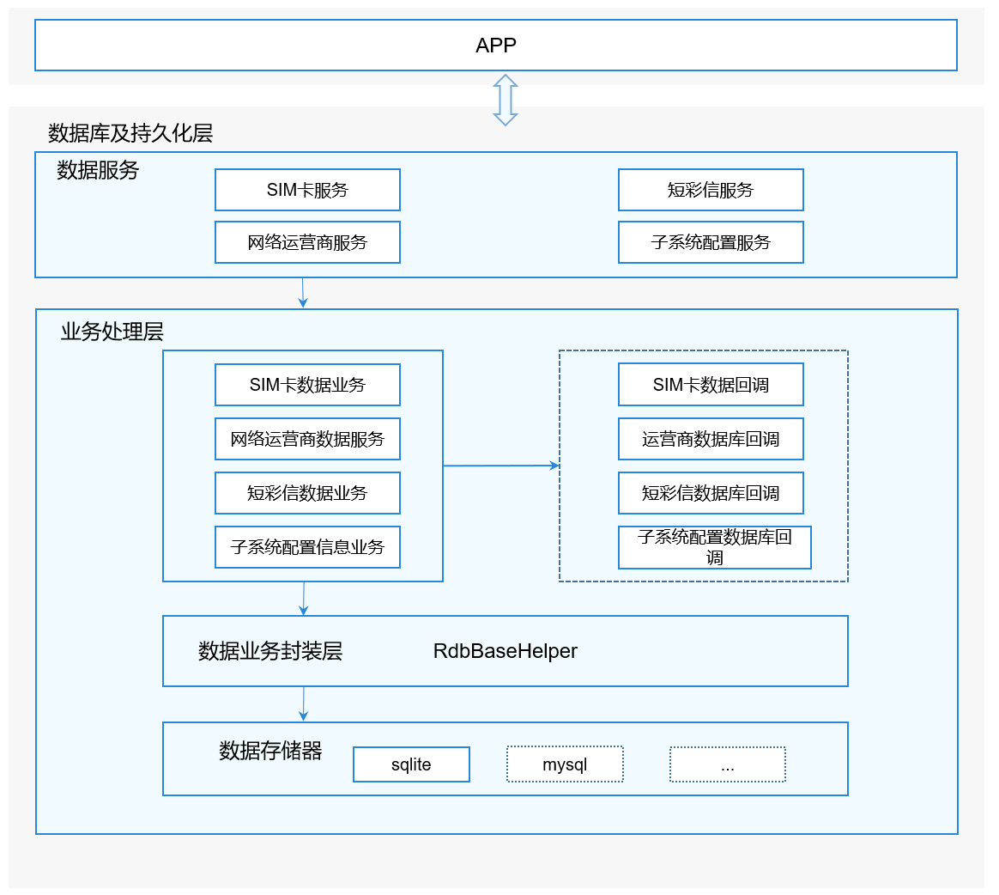

# 数据库及持久化<a name="ZH-CN_TOPIC_0000001152064139"></a>

-   [简介](#section117mcpsimp)
-   [目录](#section124mcpsimp)
-   [约束](#section128mcpsimp)
-   [说明](#section134mcpsimp)
    -   [接口说明](#section136mcpsimp)
    -   [权限说明](#section137mcpsimp)

-   [使用说明](#section163mcpsimp)
    -   [插入接口参数说明](#section1099113151207)
    -   [删除接口参数说明](#section1098113151208)
    -   [更新接口参数说明](#section1099113151207)
    -   [查询接口参数说明](#section1096113151208)
    -   [接口调用代码示例](#section1558565082915)
    
-   [相关仓](#section206mcpsimp)

## 简介<a name="section117mcpsimp"></a>

数据库及持久化模块负责电话服务子系统中的SIM卡/短彩信等模块持久化数据存储，提供DataAbility访问接口。

**图 1**  数据库及持久化架构图<a name="fig13267152558"></a>  



## 目录<a name="section124mcpsimp"></a>

```
/base/telephony/data_storage     # 数据库及持久化
├─ BUILD.gn                         # 编译gn脚本
├─ README.md                        # Readme文档
├─ common                           # 公共、通用文件
│  ├─ include                       
│  └─ src                           
├─ pdp_profile                      # 网络运营商
│  ├─ include                       
│  └─ src                           
├─ sim                              # sim卡
│  ├─ include                       
│  └─ src                           
├─ sms_mms                          # 短彩信
│  ├─ include                      
│  └─ src                           
├─ ohos.build                       # 编译build
└─ test                             # 测试相关
```

## 约束<a name="section128mcpsimp"></a>

- 开发语言：C++

- 软件约束：需要与以下服务配合使用：公共基础子库系统，应用框架子系统。

- 硬件约束：无

- 使用场景：当用户需要获取电话服务子系统中的SIM卡/短彩信等模块持久化数据时,可通过DataAbilityHelper提供的增/删/改/查接口来获取数据。

  访问时需要提供对应的权限和URI。

## 说明<a name="section134mcpsimp"></a>

### 接口说明<a name="section136mcpsimp"></a>

**表 1**  增/删/改/查接口

<a name="table165976561598"></a>

<table><thead align="left"><tr id="row1059785615915"><th class="cellrowborder" valign="top" width="50.019999999999996%" id="mcps1.2.3.1.1"><p id="p81665114103"><a name="p81665114103"></a><a name="p81665114103"></a>接口定义</p>
</th>
<th class="cellrowborder" valign="top" width="49.980000000000004%" id="mcps1.2.3.1.2"><p id="p916145121017"><a name="p916145121017"></a><a name="p916145121017"></a><strong id="b15161551111018"><a name="b15161551111018"></a><a name="b15161551111018"></a>接口描述</strong></p>
</th>
</tr>
</thead>
<tbody><tr id="row137081297171"><td class="cellrowborder" valign="top" width="50.019999999999996%" headers="mcps1.2.3.1.1 "><p id="p570813931718"><a name="p570813931718"></a><a name="p570813931718"></a>int Insert(const Uri &uri, const NativeRdb::ValuesBucket &value)</p>
</td>
<td class="cellrowborder" valign="top" width="49.980000000000004%" headers="mcps1.2.3.1.2 "><p id="p770811916175"><a name="p770811916175"></a><a name="p770811916175"></a>插入数据</p>
</td>
</tr>
<tr id="row176541675174"><td class="cellrowborder" valign="top" width="50.019999999999996%" headers="mcps1.2.3.1.1 "><p id="p06544714174"><a name="p06544714174"></a><a name="p06544714174"></a>int Delete(const Uri &uri, const NativeRdb::DataAbilityPredicates &predicates)</p>
</td>
<td class="cellrowborder" valign="top" width="49.980000000000004%" headers="mcps1.2.3.1.2 "><p id="p26546716175"><a name="p26546716175"></a><a name="p26546716175"></a>删除数据</p>
</td>
</tr>
<tr id="row1526612541718"><td class="cellrowborder" valign="top" width="50.019999999999996%" headers="mcps1.2.3.1.1 "><p id="p62673520171"><a name="p62673520171"></a><a name="p62673520171"></a>int Update(
    const Uri &uri, const NativeRdb::ValuesBucket &value, const NativeRdb::DataAbilityPredicates &predicates)</p>
</td>
<td class="cellrowborder" valign="top" width="49.980000000000004%" headers="mcps1.2.3.1.2 "><p id="p152671855177"><a name="p152671855177"></a><a name="p152671855177"></a>更新数据</p>
</td>
</tr>
<tr id="row1526612541719"><td class="cellrowborder" valign="top" width="50.019999999999996%" headers="mcps1.2.3.1.1 "><p id="p62673520171"><a name="p62673520171"></a><a name="p62673520171"></a>std::shared_ptr&lt;NativeRdb::AbsSharedResultSet&gt; Query(
    const Uri &uri, const std::vector&lt;std::string&gt; &columns, const NativeRdb::DataAbilityPredicates &predicates)</p>
</td>
<td class="cellrowborder" valign="top" width="49.980000000000004%" headers="mcps1.2.3.1.2 "><p id="p152671855177"><a name="p152671855177"></a><a name="p152671855177"></a>查询数据</p>
</td>
</tr>
</tbody>
</table>


### 权限说明<a name="section137mcpsimp"></a>

**表 2**  权限说明

<a name="table165976561598"></a>

<table><thead align="left"><tr id="row1059785615915"><th class="cellrowborder" valign="top" width="50.019999999999996%" id="mcps1.2.3.1.1"><p id="p81665114103"><a name="p81665114103"></a><a name="p81665114103"></a>模块</p>
</th>
<th class="cellrowborder" valign="top" width="49.980000000000004%" id="mcps1.2.3.1.2"><p id="p916145121017"><a name="p916145121017"></a><a name="p916145121017"></a><strong id="b15161551111018"><a name="b15161551111018"></a><a name="b15161551111018"></a>所需权限</strong></p>
</th>
</tr>
</thead>
<tbody><tr id="row137081297171"><td class="cellrowborder" valign="top" width="50.019999999999996%" headers="mcps1.2.3.1.1 "><p id="p570813931718"><a name="p570813931718"></a><a name="p570813931718"></a>短彩信模块</p>
</td>
<td class="cellrowborder" valign="top" width="49.980000000000004%" headers="mcps1.2.3.1.2 "><p id="p770811916175"><a name="p770811916175"></a><a name="p770811916175"></a>com.ohos.smsmmsability.DataAbilityShellProvider.PROVIDER</p>
</td>
</tr>
<tr id="row176541675174"><td class="cellrowborder" valign="top" width="50.019999999999996%" headers="mcps1.2.3.1.1 "><p id="p06544714174"><a name="p06544714174"></a><a name="p06544714174"></a>SIM卡模块</p>
</td>
<td class="cellrowborder" valign="top" width="49.980000000000004%" headers="mcps1.2.3.1.2 "><p id="p26546716175"><a name="p26546716175"></a><a name="p26546716175"></a>com.ohos.simability.DataAbilityShellProvider.PROVIDER</p>
</td>
</tr>
<tr id="row176541675174"><td class="cellrowborder" valign="top" width="50.019999999999996%" headers="mcps1.2.3.1.1 "><p id="p06544714174"><a name="p06544714174"></a><a name="p06544714174"></a>网络运营商模块</p>
</td>
<td class="cellrowborder" valign="top" width="49.980000000000004%" headers="mcps1.2.3.1.2 "><p id="p26546716175"><a name="p26546716175"></a><a name="p26546716175"></a>com.ohos.pdpprofileability.DataAbilityShellProvider.PROVIDER</p>
</td>
</tr>
</tbody>
</table>

## 使用说明<a name="section163mcpsimp"></a>

### 插入接口参数说明<a name="section1099113151207"></a>

**表 3**  Insert接口参数说明

<a name="table1234838197"></a>

<table><thead align="left"><tr id="row1059785615915"><th class="cellrowborder" valign="top" width="50.019999999999996%" id="mcps1.2.3.1.1"><p id="p81665114103"><a name="p81665114103"></a><a name="p81665114103"></a>参数</p>
</th>
<th class="cellrowborder" valign="top" width="49.980000000000004%" id="mcps1.2.3.1.2"><p id="p916145121017"><a name="p916145121017"></a><a name="p916145121017"></a><strong id="b15161551111018"><a name="b15161551111018"></a><a name="b15161551111018"></a>说明</strong></p>
</th>
</tr>
</thead>
<tbody><tr id="row137081297171"><td class="cellrowborder" valign="top" width="50.019999999999996%" headers="mcps1.2.3.1.1 "><p id="p570813931718"><a name="p570813931718"></a><a name="p570813931718"></a>uri</p>
</td>
<td class="cellrowborder" valign="top" width="49.980000000000004%" headers="mcps1.2.3.1.2 "><p id="p770811916175"><a name="p770811916175"></a><a name="p770811916175"></a>资源路径</p>
</td>
</tr>
<tr id="row176541675174"><td class="cellrowborder" valign="top" width="50.019999999999996%" headers="mcps1.2.3.1.1 "><p id="p06544714174"><a name="p06544714174"></a><a name="p06544714174"></a>value</p>
</td>
<td class="cellrowborder" valign="top" width="49.980000000000004%" headers="mcps1.2.3.1.2 "><p id="p26546716175"><a name="p26546716175"></a><a name="p26546716175"></a>数据集合,字段对应当前操作的表结构字段</p>
</td>
</tr>
</tbody>
</table>


### 删除接口参数说明<a name="section1098113151208"></a>

**表 4**  Delete接口参数说明

<a name="table1234838197"></a>

<table><thead align="left"><tr id="row82351335191"><th class="cellrowborder" valign="top" width="50.019999999999996%" id="mcps1.2.4.1.1"><p id="p2023519312196"><a name="p2023519312196"></a><a name="p2023519312196"></a>参数</p>
</th>
<th class="cellrowborder" valign="top" width="49.980000000000004%" id="mcps1.2.4.1.2"><p id="p1823516361916"><a name="p1823516361916"></a><a name="p1823516361916"></a>说明</p>
</th>
</tr>
</thead>
<tbody><tr id="row122350371913"><td class="cellrowborder" valign="top" width="50.019999999999996%" headers="mcps1.2.4.1.1 "><p id="p22351321915"><a name="p22351321915"></a><a name="p22351321915"></a>uri</p>
</td>
<td class="cellrowborder" valign="top" width="49.980000000000004%" headers="mcps1.2.4.1.2 "><p id="p142353317193"><a name="p142353317193"></a><a name="p142353317193"></a>资源路径</p>
</td>
</tr>
 <tr id="row9235183101918"><td class="cellrowborder" valign="top" width="50.019999999999996%" headers="mcps1.2.4.1.1 "><p id="p1523593201916"><a name="p1523593201916"></a><a name="p1523593201916"></a>value</p>
</td>
<td class="cellrowborder" valign="top" width="49.980000000000004%" headers="mcps1.2.4.1.2 "><p id="p1123553161910"><a name="p1123553161910"></a><a name="p1123553161910"></a>数据集合,字段对应当前操作的表结构字段</p>
</td>
</tr>
<tr id="row9235183101918"><td class="cellrowborder" valign="top" width="50.019999999999996%" headers="mcps1.2.4.1.1 "><p id="p1523593201916"><a name="p1523593201916"></a><a name="p1523593201916"></a>predicates</p>
</td>
<td class="cellrowborder" valign="top" width="49.980000000000004%" headers="mcps1.2.4.1.2 "><p id="p1123553161910"><a name="p1123553161910"></a><a name="p1123553161910"></a>删除条件</p>
</td>
</tr>
</tbody>
</table>


### 更新接口参数说明<a name="section1097113151210"></a>

**表 5**  Update接口参数说明

<a name="table1234838197"></a>

<table><thead align="left"><tr id="row82351335191"><th class="cellrowborder" valign="top" width="50.019999999999996%" id="mcps1.2.4.1.1"><p id="p2023519312196"><a name="p2023519312196"></a><a name="p2023519312196"></a>参数</p>
</th>
<th class="cellrowborder" valign="top" width="49.980000000000004%" id="mcps1.2.4.1.2"><p id="p1823516361916"><a name="p1823516361916"></a><a name="p1823516361916"></a>说明</p>
</th>
</tr>
</thead>
<tbody><tr id="row122350371913"><td class="cellrowborder" valign="top" width="50.019999999999996%" headers="mcps1.2.4.1.1 "><p id="p22351321915"><a name="p22351321915"></a><a name="p22351321915"></a>uri</p>
</td>
<td class="cellrowborder" valign="top" width="49.980000000000004%" headers="mcps1.2.4.1.2 "><p id="p142353317193"><a name="p142353317193"></a><a name="p142353317193"></a>资源路径</p>
</td>
</tr>
<tr id="row9235183101918"><td class="cellrowborder" valign="top" width="50.019999999999996%" headers="mcps1.2.4.1.1 "><p id="p1523593201916"><a name="p1523593201916"></a><a name="p1523593201916"></a>predicates</p>
</td>
<td class="cellrowborder" valign="top" width="49.980000000000004%" headers="mcps1.2.4.1.2 "><p id="p1123553161910"><a name="p1123553161910"></a><a name="p1123553161910"></a>更新条件</p>
</td>
</tr>
</tbody>
</table>

### 查询接口参数说明<a name="section1096113151208"></a>

**表 6**  Query接口参数说明

<a name="table1234838197"></a>

<table><thead align="left"><tr id="row82351335191"><th class="cellrowborder" valign="top" width="50.019999999999996%" id="mcps1.2.4.1.1"><p id="p2023519312196"><a name="p2023519312196"></a><a name="p2023519312196"></a>参数</p>
</th>
<th class="cellrowborder" valign="top" width="49.980000000000004%" id="mcps1.2.4.1.2"><p id="p1823516361916"><a name="p1823516361916"></a><a name="p1823516361916"></a>说明</p>
</th>
</tr>
</thead>
<tbody><tr id="row122350371913"><td class="cellrowborder" valign="top" width="50.019999999999996%" headers="mcps1.2.4.1.1 "><p id="p22351321915"><a name="p22351321915"></a><a name="p22351321915"></a>uri</p>
</td>
<td class="cellrowborder" valign="top" width="49.980000000000004%" headers="mcps1.2.4.1.2 "><p id="p142353317193"><a name="p142353317193"></a><a name="p142353317193"></a>资源路径</p>
</td>
</tr>
 <tr id="row9235183101918"><td class="cellrowborder" valign="top" width="50.019999999999996%" headers="mcps1.2.4.1.1 "><p id="p1523593201916"><a name="p1523593201916"></a><a name="p1523593201916"></a>columns</p>
</td>
<td class="cellrowborder" valign="top" width="49.980000000000004%" headers="mcps1.2.4.1.2 "><p id="p1123553161910"><a name="p1123553161910"></a><a name="p1123553161910"></a>查询返回的字段</p>
</td>
</tr>
<tr id="row9235183101918"><td class="cellrowborder" valign="top" width="50.019999999999996%" headers="mcps1.2.4.1.1 "><p id="p1523593201916"><a name="p1523593201916"></a><a name="p1523593201916"></a>predicates</p>
</td>
<td class="cellrowborder" valign="top" width="49.980000000000004%" headers="mcps1.2.4.1.2 "><p id="p1123553161910"><a name="p1123553161910"></a><a name="p1123553161910"></a>查询条件</p>
</td>
</tr>
</tbody>
</table>


### 接口调用代码示例<a name="section1558565082915"></a>

以查询/插入/删除/更新短彩信数据为例，主要步骤和代码如下：

1. 使用SystemAbilityManagerClient获得SystemAbilityManager对象。
2. 使用saManager获得指定服务Id的IRemoteObject对象。
3. 使用IRemoteObject创建DataAbilityHelper对象。
4. 调用DataAbilityHelper::Query接口访问，并接收处理返回的数据。  

   创建DataAbilityHelper:
   ```
   std::shared_ptr<AppExecFwk::DataAbilityHelper> CreateDataAHelper(int32_t systemAbilityId)
   {
       DATA_STORAGE_LOGD("DataSimRdbHelper::CreateDataAHelper");
       //通过SystemAbilityManagerClient获得SystemAbilityManager
       auto saManager = SystemAbilityManagerClient::GetInstance().GetSystemAbilityManager();
       if (saManager == nullptr) {
           DATA_STORAGE_LOGE("DataSimRdbHelper Get system ability mgr failed.");
           return nullptr;
       }
       // 获得IRemoteObject
       auto remoteObj = saManager->GetSystemAbility(systemAbilityId);
       while (remoteObj == nullptr) {
           DATA_STORAGE_LOGE("DataSimRdbHelper GetSystemAbility Service Failed.");
           return nullptr;
       }
       // 创建DataAbilityHelper
       return AppExecFwk::DataAbilityHelper::Creator(remoteObj);
   }
   ```
   查询短彩信信息:
   ```
   std::shared_ptr<NativeRdb::AbsSharedResultSet> SmsSelect(std::shared_ptr<AppExecFwk::DataAbilityHelper> helper)
   {	
       // 资源路径
       Uri uri("dataability:///com.ohos.smsmmsability/sms_mms/sms_mms_info");
       //查询返回的字段
       std::vector<std::string> colume;
       // 发送者号码
       colume.push_back("sender_number");
       // 消息标题
       colume.push_back("msg_title");
       // 消息内容
       colume.push_back("msg_content");
       // 查询谓词
       NativeRdb::DataAbilityPredicates predicates;
       // 调用DataAbilityHelper::Query接口查询
       return helper->Query(uri, colume, predicates);
   }
   ```
   插入短彩信信息:
   ```
   int SmsInsert(std::shared_ptr<AppExecFwk::DataAbilityHelper> helper)
   {
       Uri uri("dataability:///com.ohos.smsmmsability/sms_mms/sms_mms_info");
       NativeRdb::ValuesBucket value;
       // 接收者号码
       value.PutString(SmsMmsInfo::RECEIVER_NUMBER, "138XXXXXXXX");
       // 消息内容
       value.PutString(SmsMmsInfo::MSG_CONTENT, "ceshi");
       value.PutInt(SmsMmsInfo::GROUP_ID, 1);
       return helper->Insert(uri, value);
   }
   ```
   删除短彩信信息:
   ```
    int SmsDelete(std::shared_ptr<AppExecFwk::DataAbilityHelper> helper)
    {
        Uri uri("dataability:///com.ohos.smsmmsability/sms_mms/sms_mms_info");
        NativeRdb::DataAbilityPredicates predicates;
        // 删除MSG_ID为1的信息
        predicates.EqualTo(SmsMmsInfo::MSG_ID, "1");
        return helper->Delete(uri, predicates);
    }
   ```
   更新短彩信信息：
   ```
   int SmsUpdate(std::shared_ptr<AppExecFwk::DataAbilityHelper> helper)
   {
       Uri uri("dataability:///com.ohos.smsmmsability/sms_mms/sms_mms_info");
       NativeRdb::ValuesBucket values;
       // 信息内容
       values.PutString(SmsMmsInfo::MSG_CONTENT, "hi ohos");
       NativeRdb::DataAbilityPredicates predicates;
       // 信息Id
       predicates.EqualTo(SmsMmsInfo::MSG_ID, "1");
       return helper->Update(uri, values, predicates);
   }
   ```


## 相关仓<a name="section206mcpsimp"></a>

[电话服务子系统](https://gitee.com/openharmony/docs/blob/master/zh-cn/readme/%E7%94%B5%E8%AF%9D%E6%9C%8D%E5%8A%A1%E5%AD%90%E7%B3%BB%E7%BB%9F.md)

**telephony_data_storage**

[telephony_core_service](https://gitee.com/openharmony/telephony_core_service/blob/master/README_zh.md)

[telephony_sms_mms](https://gitee.com/openharmony/telephony_sms_mms/blob/master/README_zh.md)

[telephony_cellular_call](https://gitee.com/openharmony/telephony_cellular_call/blob/master/README_zh.md)

[telephony_call_manager](https://gitee.com/openharmony/telephony_call_manager/blob/master/README_zh.md)

